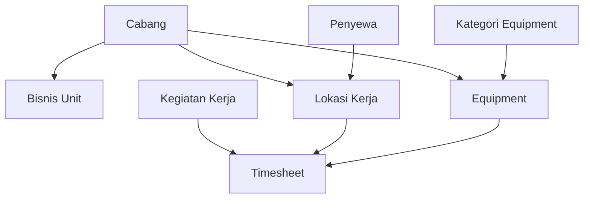

# MIGRASI WEB - 01 MASTER DATA

## 📋 Module Overview

Master Data module contains all core reference data that is used throughout the application. This is the foundation module that other modules depend on.

**Total Features:** 9  
**Priority:** 🔴 CRITICAL (Must migrate first)

---

## 🗂️ Features List

### 1. DOM (Dummy Order Management)
**Route:** `/dom`  
**API:** `src/api/dom.js`  
**Views:** `src/views/master/dom/`

#### Pages
- **List:** `/dom` - Display all DOM records
- **Create:** `/dom/create` - Create new DOM
- **Show:** `/dom/[id]/show` - View DOM details
- **Delete:** `/dom/[id]/destroy` - Delete DOM (confirmation page)

#### API Endpoints
```javascript
{
  key: '/api/master/dom',
  list: '/list',
  create: '/create',
  show: '/:id',
  update: '/:id/update',
  delete: '/:id/destroy'
}
```

#### Features
- ✅ CRUD operations
- ✅ Pagination
- ✅ Search/Filter
- ✅ Desktop/Mobile responsive views
- ✅ Soft delete with confirmation
- ✅ Offline queue support

#### Data Structure
```typescript
interface DOM {
  id: number
  nama: string
  keterangan?: string
  status: 'active' | 'inactive'
  created_at: string
  updated_at: string
}
```

#### Form Fields
- Nama (text, required)
- Keterangan (textarea, optional)
- Status (select, required)

---

### 2. Equipment
**Route:** `/equipment`  
**API:** `src/api/equipment.js`  
**Views:** `src/views/master/equipment/`

#### Pages
- **List:** `/equipment`
- **Create:** `/equipment/create`
- **Show:** `/equipment/[id]/show`

#### API Endpoints
```javascript
{
  key: '/api/master/equipment',
  list: '/list',
  create: '/create',
  show: '/:id',
  update: '/:id/update',
  delete: '/:id/destroy'
}
```

#### Features
- ✅ CRUD operations
- ✅ Equipment categorization
- ✅ Equipment status tracking
- ✅ Ownership tracking (own/rental)
- ✅ Branch assignment
- ✅ Image upload (S3)
- ✅ QR Code generation
- ✅ Offline support

#### Data Structure
```typescript
interface Equipment {
  id: number
  nama: string
  kode: string
  no_lambung?: string
  no_polisi?: string
  kategori_id: number
  kategori?: KategoriEquipment
  cabang_id: number
  cabang?: Cabang
  kepemilikan: 'milik_sendiri' | 'sewa'
  pemilik?: string
  status: 'active' | 'maintenance' | 'inactive'
  tahun_pembuatan?: number
  foto?: string
  qr_code?: string
  created_at: string
  updated_at: string
}
```

#### Form Fields
- Nama Equipment (text, required)
- Kode Equipment (text, required, unique)
- No Lambung (text, optional)
- No Polisi (text, optional)
- Kategori (select from API, required)
- Cabang (select from API, required)
- Kepemilikan (radio: milik_sendiri/sewa, required)
- Pemilik (text, conditional: required if sewa)
- Status (select, required)
- Tahun Pembuatan (number, optional)
- Foto (image upload, optional)

#### Dependencies
- `src/api/kategori-equipment.js` - Equipment categories
- `src/api/cabang.js` - Branches
- `src/components/OptionCabang.js`
- AWS S3 for image storage

---

### 3. Barang/Sparepart
**Route:** `/barang`  
**API:** `src/api/barang.js`  
**Views:** `src/views/master/barang/`

#### Pages
- **List:** `/barang`
- **Create:** `/barang/create`
- **Show:** `/barang/[id]/show`

#### API Endpoints
```javascript
{
  key: '/api/master/barang',
  list: '/list',
  create: '/create',
  show: '/:id',
  update: '/:id/update',
  delete: '/:id/destroy'
}
```

#### Features
- ✅ CRUD operations
- ✅ Stock tracking
- ✅ Unit of measurement (UOM)
- ✅ Minimum stock alert
- ✅ Barcode/SKU management
- ✅ Category management
- ✅ Image upload
- ✅ Offline support

#### Data Structure
```typescript
interface Barang {
  id: number
  kode: string
  nama: string
  kategori?: string
  satuan: string
  stok_min?: number
  stok_current?: number
  harga_satuan?: number
  keterangan?: string
  foto?: string
  barcode?: string
  status: 'active' | 'inactive'
  created_at: string
  updated_at: string
}
```

#### Form Fields
- Kode Barang (text, required, unique)
- Nama Barang (text, required)
- Kategori (text, optional)
- Satuan (text, required, e.g., "pcs", "liter", "kg")
- Stok Minimum (number, optional)
- Harga Satuan (number, optional)
- Keterangan (textarea, optional)
- Foto (image upload, optional)
- Status (select, required)

---

### 4. Material
**Route:** `/material`  
**API:** `src/api/material.js`  
**Views:** `src/views/master/material/`

#### Pages
- **List:** `/material` (Read-only, no CRUD)

#### API Endpoints
```javascript
{
  key: '/api/master/material',
  list: '/list'
}
```

#### Features
- ✅ View material types
- ✅ Simple list display
- ⚠️ No create/edit (managed in backend)

#### Data Structure
```typescript
interface Material {
  id: number
  nama: string
  satuan: string
  keterangan?: string
}
```

---

### 5. Lokasi Kerja (Work Location)
**Route:** `/lokasi-kerja`  
**API:** `src/api/lokasi-kerja.js`  
**Views:** `src/views/master/lokasi-kerja/`

#### Pages
- **List:** `/lokasi-kerja`
- **Create:** `/lokasi-kerja/create`
- **Edit:** `/lokasi-kerja/[id]`

#### API Endpoints
```javascript
{
  key: '/api/master/lokasi-kerja',
  list: '/list',
  create: '/create',
  show: '/:id',
  update: '/:id/update',
  delete: '/:id/destroy'
}
```

#### Features
- ✅ CRUD operations
- ✅ Hierarchical location (Pit within location)
- ✅ GPS coordinates
- ✅ Branch assignment
- ✅ Tenant assignment
- ✅ Activity type (rental/barging/mining/explorasi)
- ✅ Google Maps integration
- ✅ Offline support

#### Data Structure
```typescript
interface LokasiKerja {
  id: number
  nama: string
  nama_pit?: string
  latitude?: string
  longitude?: string
  cabang_id: number
  cabang?: Cabang
  penyewa_id: number
  penyewa?: Penyewa
  kegiatan: 'rental' | 'barging' | 'mining' | 'explorasi'
  keterangan?: string
  status: 'active' | 'inactive'
  created_at: string
  updated_at: string
}
```

#### Form Fields
- Nama Lokasi (text, required)
- Nama Pit (text, optional)
- Cabang (select from API, required)
- Penyewa (select from API, required)
- Jenis Kegiatan (select: rental/barging/mining/explorasi, required)
- Latitude (text, optional, format: decimal degrees)
- Longitude (text, optional, format: decimal degrees)
- Keterangan (textarea, optional)
- Status (select, required)

#### Dependencies
- `src/components/OptionCabang.js`
- `src/components/OptionPenyewa.js`
- Google Maps API (for coordinate picking)

---

### 6. Kegiatan Kerja (Work Activity)
**Route:** `/kegiatan-kerja`  
**API:** `src/api/kegiatan-kerja.js`  
**Views:** `src/views/master/kegiatan-kerja/`

#### Pages
- **List:** `/kegiatan-kerja`
- **Create:** `/kegiatan-kerja/create`
- **Edit:** `/kegiatan-kerja/[id]`

#### API Endpoints
```javascript
{
  key: '/api/master/kegiatan-kerja',
  list: '/list',
  create: '/create',
  show: '/:id',
  update: '/:id/update',
  delete: '/:id/destroy'
}
```

#### Features
- ✅ CRUD operations
- ✅ Activity code generation
- ✅ Activity type categorization
- ✅ Unit pricing
- ✅ Offline support

#### Data Structure
```typescript
interface KegiatanKerja {
  id: number
  kode: string
  nama: string
  jenis_kegiatan: 'rental' | 'barging' | 'mining' | 'explorasi'
  satuan: string
  harga_satuan?: number
  keterangan?: string
  status: 'active' | 'inactive'
  created_at: string
  updated_at: string
}
```

#### Form Fields
- Kode Kegiatan (text, required, unique)
- Nama Kegiatan (text, required)
- Jenis Kegiatan (select, required)
- Satuan (text, required, e.g., "jam", "ritase", "m³")
- Harga Satuan (number, optional)
- Keterangan (textarea, optional)
- Status (select, required)

---

### 7. Penyewa (Tenant/Client)
**Route:** `/penyewa`  
**API:** `src/api/penyewa.js`  
**Views:** `src/views/master/penyewa/`

#### Pages
- **List:** `/penyewa`
- **Create:** `/penyewa/create`
- **Edit:** `/penyewa/[id]`

#### API Endpoints
```javascript
{
  key: '/api/master/penyewa',
  list: '/list',
  create: '/create',
  show: '/:id',
  update: '/:id/update',
  delete: '/:id/destroy'
}
```

#### Features
- ✅ CRUD operations
- ✅ Company information
- ✅ Contact details
- ✅ Tax information (NPWP)
- ✅ Address management
- ✅ Logo upload
- ✅ Offline support

#### Data Structure
```typescript
interface Penyewa {
  id: number
  kode: string
  nama: string
  npwp?: string
  alamat?: string
  telepon?: string
  email?: string
  pic_name?: string
  pic_phone?: string
  logo?: string
  status: 'active' | 'inactive'
  created_at: string
  updated_at: string
}
```

#### Form Fields
- Kode Penyewa (text, required, unique)
- Nama Perusahaan (text, required)
- NPWP (text, optional, format: 15 digits)
- Alamat (textarea, optional)
- Telepon (text, optional)
- Email (email, optional)
- PIC Name (text, optional)
- PIC Phone (text, optional)
- Logo (image upload, optional)
- Status (select, required)

---

### 8. Cabang (Branch)
**Route:** `/cabang`  
**API:** `src/api/cabang.js`  
**Views:** `src/views/master/cabang/`

#### Pages
- **List:** `/cabang`
- **Create:** `/cabang/create`
- **Edit:** `/cabang/[id]`

#### API Endpoints
```javascript
{
  key: '/api/master/cabang',
  list: '/list',
  create: '/create',
  show: '/:id',
  update: '/:id/update',
  delete: '/:id/destroy'
}
```

#### Features
- ✅ CRUD operations
- ✅ Branch code generation
- ✅ Address management
- ✅ GPS coordinates
- ✅ Branch manager assignment
- ✅ Offline support

#### Data Structure
```typescript
interface Cabang {
  id: number
  kode: string
  nama: string
  alamat?: string
  kota?: string
  provinsi?: string
  kode_pos?: string
  latitude?: string
  longitude?: string
  telepon?: string
  manager_id?: number
  manager?: User
  status: 'active' | 'inactive'
  created_at: string
  updated_at: string
}
```

#### Form Fields
- Kode Cabang (text, required, unique)
- Nama Cabang (text, required)
- Alamat (textarea, optional)
- Kota (text, optional)
- Provinsi (text, optional)
- Kode Pos (text, optional)
- Latitude (text, optional)
- Longitude (text, optional)
- Telepon (text, optional)
- Manager (select from users, optional)
- Status (select, required)

---

### 9. Bisnis Unit
**Route:** `/bisnis-unit`  
**API:** `src/api/bisnis-unit.js`  
**Views:** `src/views/master/bisnis-unit/`

#### Pages
- **List:** `/bisnis-unit`
- **Create:** `/bisnis-unit/create`
- **Edit:** `/bisnis-unit/[id]`

#### API Endpoints
```javascript
{
  key: '/api/master/bisnis-unit',
  list: '/list',
  create: '/create',
  show: '/:id',
  update: '/:id/update',
  delete: '/:id/destroy'
}
```

#### Features
- ✅ CRUD operations
- ✅ Business unit hierarchy
- ✅ Branch assignment
- ✅ Unit manager assignment
- ✅ Offline support

#### Data Structure
```typescript
interface BisnisUnit {
  id: number
  kode: string
  nama: string
  cabang_id: number
  cabang?: Cabang
  manager_id?: number
  manager?: User
  keterangan?: string
  status: 'active' | 'inactive'
  created_at: string
  updated_at: string
}
```

#### Form Fields
- Kode Bisnis Unit (text, required, unique)
- Nama Bisnis Unit (text, required)
- Cabang (select from API, required)
- Manager (select from users, optional)
- Keterangan (textarea, optional)
- Status (select, required)

---

## 🔗 Module Dependencies

### Internal Dependencies


### External Dependencies
- AWS S3 (image uploads)
- Google Maps API (coordinates)
- NextAuth.js (user selection)

---

## 📋 Migration TODO - Master Data

### Phase 1: Setup & Infrastructure
- [ ] Set up new project structure
- [ ] Configure AWS S3 integration
- [ ] Configure Google Maps API
- [ ] Set up Axios instance with auth
- [ ] Create base API hook pattern
- [ ] Create base CRUD components

### Phase 2: Core Components
- [ ] Create shared form components
  - [ ] Select component
  - [ ] Input component
  - [ ] Textarea component
  - [ ] Image upload component
  - [ ] Date picker component
- [ ] Create shared table components
  - [ ] DataTable desktop
  - [ ] DataTable mobile
  - [ ] Pagination component
  - [ ] Filter component
- [ ] Create shared option components
  - [ ] OptionCabang
  - [ ] OptionPenyewa
  - [ ] OptionEquipment
  - [ ] OptionKegiatanKerja
  - [ ] OptionLokasiPit

### Phase 3: Master Data Features (In Order)
#### 1. Cabang (First - no dependencies)
- [ ] Create API hooks
- [ ] Create list page with table
- [ ] Create form page (create/edit)
- [ ] Implement validation
- [ ] Test CRUD operations
- [ ] Test offline mode

#### 2. Penyewa (Second - no dependencies)
- [ ] Create API hooks
- [ ] Create list page with table
- [ ] Create form page (create/edit)
- [ ] Implement logo upload
- [ ] Implement validation
- [ ] Test CRUD operations
- [ ] Test offline mode

#### 3. Bisnis Unit (Depends: Cabang)
- [ ] Create API hooks
- [ ] Create list page
- [ ] Create form page
- [ ] Integrate OptionCabang
- [ ] Test CRUD operations

#### 4. Kategori Equipment (Backend only)
- [ ] Create API hooks (read-only)
- [ ] Test fetching

#### 5. Equipment (Depends: Cabang, Kategori)
- [ ] Create API hooks
- [ ] Create list page
- [ ] Create show page with details
- [ ] Create form page
- [ ] Implement image upload
- [ ] Implement QR code generation
- [ ] Integrate OptionCabang
- [ ] Test CRUD operations
- [ ] Test offline mode

#### 6. Kegiatan Kerja (Independent)
- [ ] Create API hooks
- [ ] Create list page
- [ ] Create form page
- [ ] Test CRUD operations
- [ ] Test offline mode

#### 7. Lokasi Kerja (Depends: Cabang, Penyewa)
- [ ] Create API hooks
- [ ] Create list page
- [ ] Create form page
- [ ] Integrate Google Maps for coordinates
- [ ] Integrate OptionCabang
- [ ] Integrate OptionPenyewa
- [ ] Test CRUD operations
- [ ] Test offline mode

#### 8. Barang/Sparepart (Independent)
- [ ] Create API hooks
- [ ] Create list page
- [ ] Create show page
- [ ] Create form page
- [ ] Implement image upload
- [ ] Implement barcode display
- [ ] Test CRUD operations
- [ ] Test offline mode

#### 9. Material (Read-only)
- [ ] Create API hooks
- [ ] Create list page
- [ ] Test data fetching

#### 10. DOM (Independent)
- [ ] Create API hooks
- [ ] Create list page
- [ ] Create show page
- [ ] Create form page
- [ ] Create delete confirmation page
- [ ] Test CRUD operations
- [ ] Test offline mode

### Phase 4: Testing & Validation
- [ ] Test all master data CRUD operations
- [ ] Test all dependencies between modules
- [ ] Test offline mode for all modules
- [ ] Test image uploads
- [ ] Test form validations
- [ ] Test error handling
- [ ] Test mobile responsiveness
- [ ] Test data integrity

### Phase 5: Documentation
- [ ] Document API endpoints
- [ ] Document component usage
- [ ] Create user guide for each feature
- [ ] Document validation rules
- [ ] Document business logic

---

## ✅ Validation Rules Summary

### Common Rules
- All status fields default to 'active'
- All kode fields must be unique
- Created/updated timestamps automatic

### Equipment
- No Polisi: uppercase, alphanumeric
- Tahun Pembuatan: 1900-current year
- Pemilik required if kepemilikan = 'sewa'

### Barang
- Kode: uppercase, alphanumeric
- Stok minimum >= 0
- Harga satuan >= 0

### Lokasi Kerja
- Latitude: -90 to 90
- Longitude: -180 to 180
- Coordinates optional but both required if one filled

### Penyewa
- NPWP: 15 digits
- Email: valid email format
- Phone: numbers only

### Cabang
- Kode Pos: 5 digits
- Coordinates: same as Lokasi Kerja

---

## 🎯 Success Criteria

- [ ] All 9 master data features fully functional
- [ ] All CRUD operations working
- [ ] All dependencies resolved correctly
- [ ] Offline mode working for all features
- [ ] Image uploads working (Equipment, Barang, Penyewa)
- [ ] Form validations complete
- [ ] Mobile responsive
- [ ] No data loss during migration
- [ ] Performance acceptable (< 2s page load)

---

**Priority:** 🔴 CRITICAL  
**Estimated Effort:** 40-50 hours  
**Dependencies:** None (Foundation module)  
**Risk Level:** High (affects all other modules)
