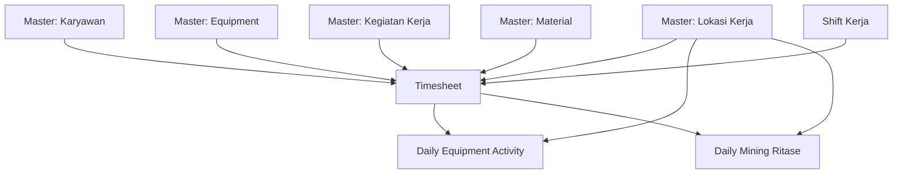

# MIGRASI WEB - 02 OPERATIONAL MINING

## 📋 Module Overview

Operational Mining module handles daily mining operations, equipment activity tracking, and timesheet management. This is the core business module for mining operations.

**Total Features:** 3  
**Priority:** 🔴 CRITICAL (Core business operations)

---

## 🗂️ Features List

### 1. Timesheet
**Route:** `/timesheet`  
**API:** `src/api/daily-timesheet.js`  
**Views:** `src/views/operational/timesheet/`

#### Pages
- **List:** `/timesheet` - Display all timesheet records
- **Create:** `/timesheet/create` - Create new timesheet
- **Show (General):** `/timesheet/[id]/show` - View timesheet summary
- **Show (DT):** `/timesheet/[id]/show-dt` - View DumpTruck timesheet details
- **Show (HE):** `/timesheet/[id]/show-he` - View Heavy Equipment timesheet details

#### API Endpoints
```javascript
{
  key: '/api/operational/timesheet',
  list: '/list',
  create: '/create',
  show: '/:id',
  showDT: '/:id/dump-truck',
  showHE: '/:id/heavy-equipment',
  update: '/:id/update',
  delete: '/:id/destroy',
  // Additional endpoints
  byEmployee: '/karyawan/:karyawan_id',
  byEquipment: '/equipment/:equipment_id',
  byDate: '/tanggal/:tanggal',
  summary: '/summary'
}
```

#### Features
- ✅ Multi-type timesheet (DT/HE)
- ✅ CRUD operations
- ✅ Employee assignment
- ✅ Equipment assignment
- ✅ Work location tracking
- ✅ Activity tracking
- ✅ Shift management
- ✅ Working hours calculation
- ✅ Break time tracking
- ✅ Ritase/trip counting
- ✅ Production volume tracking
- ✅ Material tracking
- ✅ Offline support
- ✅ OCR integration for auto-fill
- ✅ GPS coordinates
- ✅ Photo evidence upload
- ✅ Digital signature

#### Data Structure
```typescript
interface Timesheet {
  id: number
  tanggal: string // Date
  shift_id: number
  shift?: Shift
  
  // Employee & Equipment
  karyawan_id: number
  karyawan?: Karyawan
  equipment_id: number
  equipment?: Equipment
  
  // Location & Activity
  lokasi_kerja_id: number
  lokasi_kerja?: LokasiKerja
  kegiatan_kerja_id: number
  kegiatan_kerja?: KegiatanKerja
  
  // Work Details
  jam_mulai: string // Time
  jam_selesai: string // Time
  jam_istirahat?: number // Minutes
  total_jam_kerja?: number // Hours (calculated)
  
  // Production (for DT)
  ritase?: number
  jarak_tempuh?: number // KM
  volume_produksi?: number
  material_id?: number
  material?: Material
  
  // Production (for HE)
  hourmeter_awal?: number
  hourmeter_akhir?: number
  total_hourmeter?: number // Calculated
  fuel_liter?: number
  
  // Location
  latitude?: string
  longitude?: string
  
  // Evidence
  foto_kerja?: string[]
  signature?: string
  
  // Notes
  keterangan?: string
  catatan_supervisor?: string
  
  // Validation
  validated_by?: number
  validated_at?: string
  
  status: 'draft' | 'submitted' | 'validated' | 'rejected'
  created_at: string
  updated_at: string
  created_by: number
}
```

#### Form Fields (DumpTruck)
- Tanggal (date, required)
- Shift (select from API, required)
- Karyawan (autocomplete from API, required)
- Equipment (autocomplete DT only, required)
- Lokasi Kerja (select from API, required)
- Kegiatan (select from API, required)
- Jam Mulai (time, required)
- Jam Selesai (time, required)
- Jam Istirahat (number, minutes, optional)
- Ritase (number, required)
- Jarak Tempuh (number, km, optional)
- Volume Produksi (number, m³, optional)
- Material (select from API, optional)
- Foto Kerja (multiple images, optional)
- Keterangan (textarea, optional)

#### Form Fields (Heavy Equipment)
- Tanggal (date, required)
- Shift (select from API, required)
- Karyawan (autocomplete from API, required)
- Equipment (autocomplete HE only, required)
- Lokasi Kerja (select from API, required)
- Kegiatan (select from API, required)
- Jam Mulai (time, required)
- Jam Selesai (time, required)
- Jam Istirahat (number, minutes, optional)
- Hourmeter Awal (number, required)
- Hourmeter Akhir (number, required)
- BBM (number, liter, optional)
- Foto Kerja (multiple images, optional)
- Keterangan (textarea, optional)

#### Business Logic
1. **Total Jam Kerja Calculation:**
   ```javascript
   total_jam_kerja = (jam_selesai - jam_mulai) - (jam_istirahat / 60)
   ```

2. **Total Hourmeter Calculation:**
   ```javascript
   total_hourmeter = hourmeter_akhir - hourmeter_awal
   ```

3. **Validation Rules:**
   - Jam selesai > Jam mulai
   - Hourmeter akhir > Hourmeter awal
   - Cannot create timesheet for future dates
   - Cannot duplicate timesheet (same date, employee, equipment)
   - Equipment must be available (not assigned elsewhere on same time)

#### Dependencies
- `src/api/karyawan.js` - Employee data
- `src/api/equipment.js` - Equipment data
- `src/api/lokasi-kerja.js` - Work locations
- `src/api/kegiatan-kerja.js` - Work activities
- `src/api/shiftkerja.js` - Shifts
- `src/api/material.js` - Materials
- `src/components/OptionLokasiPit.js`
- `src/components/OptionEquipment.js`
- `src/components/OptionKegiatanKerja.js`
- AWS S3 for image upload
- Google Maps API for coordinates

#### OCR Integration
Located in `src/views/other/upload-ocr/`

**OCR Endpoints:**
- `/timesheet-ocr-ab` - OCR for Android screenshots
- `/timesheet-ocr-dt` - OCR for DumpTruck screenshots

**OCR Process:**
1. User uploads screenshot from mobile app
2. Tesseract.js processes image
3. Extract data: tanggal, nama, equipment, ritase, jam
4. Auto-fill timesheet form
5. User validates and submits

**Supported Formats:**
- Android timesheet screenshot
- iOS timesheet screenshot
- PDF timesheet (future)

---

### 2. Daily Equipment Activity
**Route:** `/daily-equipment-activity`  
**API:** `src/api/kegiatan-mining.js`  
**Views:** `src/views/operational/mining/daily-equipment-activity/`

#### Pages
- **Dashboard:** `/daily-equipment-activity` - Daily activity overview

#### API Endpoints
```javascript
{
  key: '/api/operational/daily-equipment-activity',
  list: '/list',
  byDate: '/tanggal/:tanggal',
  byEquipment: '/equipment/:equipment_id',
  summary: '/summary',
  export: '/export'
}
```

#### Features
- ✅ Real-time equipment activity monitoring
- ✅ Filter by date
- ✅ Filter by equipment
- ✅ Filter by location
- ✅ Filter by shift
- ✅ Activity status (working/idle/maintenance)
- ✅ Working hours summary
- ✅ Production summary
- ✅ Fuel consumption tracking
- ✅ Export to Excel/PDF
- ✅ Dashboard widgets
- ✅ Charts/graphs

#### Data Display
```typescript
interface DailyEquipmentActivity {
  tanggal: string
  equipment_id: number
  equipment: Equipment
  total_ritase: number
  total_jam_kerja: number
  total_volume: number
  total_fuel: number
  status: 'working' | 'idle' | 'maintenance' | 'breakdown'
  last_activity?: Timesheet
  location?: LokasiKerja
}
```

#### Dashboard Widgets
1. **Equipment Status Summary**
   - Total equipment
   - Working count
   - Idle count
   - Maintenance count

2. **Production Summary**
   - Total ritase today
   - Total volume today
   - Average ritase per equipment
   - Target vs actual

3. **Fuel Consumption**
   - Total fuel consumed
   - Average per equipment
   - Fuel efficiency

4. **Activity Timeline**
   - Equipment activity by hour
   - Gantt chart view

#### Filters
- Date range picker
- Equipment multi-select
- Location multi-select
- Shift select
- Status multi-select

#### Export Features
- Export to Excel (.xlsx)
- Export to PDF
- Date range export
- Summary report
- Detailed report

---

### 3. Daily Mining Ritase
**Route:** `/daily-mining-ritase`  
**API:** `src/api/mining-produksi.js`  
**Views:** `src/views/operational/mining/daily-mining-ritase/`

#### Pages
- **Dashboard:** `/daily-mining-ritase` - Daily ritase monitoring

#### API Endpoints
```javascript
{
  key: '/api/operational/mining-ritase',
  list: '/list',
  byDate: '/tanggal/:tanggal',
  byLocation: '/lokasi/:lokasi_id',
  summary: '/summary',
  hourly: '/hourly',
  export: '/export'
}
```

#### Features
- ✅ Real-time ritase monitoring
- ✅ Hourly ritase tracking
- ✅ Location-based tracking
- ✅ Material tracking
- ✅ Volume calculation
- ✅ Target vs actual comparison
- ✅ Live updates
- ✅ Charts/graphs
- ✅ Export to Excel/PDF
- ✅ Alert system (target not met)

#### Data Display
```typescript
interface DailyMiningRitase {
  tanggal: string
  lokasi_kerja_id: number
  lokasi_kerja: LokasiKerja
  material_id: number
  material: Material
  
  // Hourly breakdown
  ritase_per_hour: {
    jam: number // 0-23
    ritase: number
    volume: number
  }[]
  
  // Summary
  total_ritase: number
  total_volume: number
  target_ritase: number
  target_volume: number
  achievement_percentage: number
  
  // Equipment involved
  equipment_count: number
  equipment_list: Equipment[]
}
```

#### Dashboard Widgets
1. **Ritase Summary**
   - Total ritase today
   - Target ritase
   - Achievement percentage
   - Remaining target

2. **Volume Summary**
   - Total volume (m³)
   - Target volume
   - Achievement percentage
   - Average volume per ritase

3. **Hourly Ritase Chart**
   - Bar chart by hour
   - Line graph target vs actual
   - Peak hours indicator

4. **Location Breakdown**
   - Ritase per location
   - Volume per location
   - Pie chart distribution

5. **Material Breakdown**
   - Ritase per material
   - Volume per material
   - Material type distribution

#### Real-time Features
- Auto-refresh every 5 minutes
- WebSocket updates (future)
- Live ritase counter
- Alert notifications

#### Alert System
- Target not met alert (hourly)
- Equipment breakdown alert
- Low production alert
- Shift end summary alert

---

## 🔗 Module Dependencies

### Internal Dependencies


### External Dependencies
- AWS S3 (photo uploads)
- Google Maps API (GPS coordinates)
- Tesseract.js (OCR)
- Chart.js / Recharts (graphs)
- Export libraries (XLSX, jsPDF)

---

## 📋 Migration TODO - Operational

### Phase 1: Core Timesheet
#### Setup
- [ ] Set up Tesseract.js for OCR
- [ ] Set up chart library (Recharts/Chart.js)
- [ ] Set up export library (XLSX, jsPDF)
- [ ] Configure image upload (multiple files)

#### API Hooks
- [ ] Create timesheet API hooks
  - [ ] useGetTimesheet (list)
  - [ ] useShowTimesheet (detail)
  - [ ] useShowTimesheetDT (DT detail)
  - [ ] useShowTimesheetHE (HE detail)
  - [ ] useCreateTimesheet (mutation)
  - [ ] useUpdateTimesheet (mutation)
  - [ ] useDeleteTimesheet (mutation)
- [ ] Create shift API hooks
- [ ] Create mining activity API hooks
- [ ] Create mining production API hooks

#### Timesheet List Page
- [ ] Create desktop table view
- [ ] Create mobile card view
- [ ] Implement pagination
- [ ] Implement filters
  - [ ] Date range
  - [ ] Employee
  - [ ] Equipment
  - [ ] Location
  - [ ] Status
- [ ] Implement sorting
- [ ] Add export button
- [ ] Add bulk actions

#### Timesheet Create Page
- [ ] Create form layout
- [ ] Implement equipment type detection
- [ ] Create DT form fields
- [ ] Create HE form fields
- [ ] Implement dynamic field switching
- [ ] Add time pickers
- [ ] Add autocomplete for karyawan
- [ ] Add autocomplete for equipment
- [ ] Integrate OptionLokasiPit
- [ ] Integrate OptionKegiatanKerja
- [ ] Add material selector
- [ ] Implement multiple image upload
- [ ] Add signature pad
- [ ] Implement GPS coordinates
- [ ] Add working hours calculator
- [ ] Add hourmeter calculator
- [ ] Implement form validation
- [ ] Add offline queue support
- [ ] Test form submission

#### Timesheet Show Pages
- [ ] Create general show page
  - [ ] Display summary info
  - [ ] Display employee info
  - [ ] Display equipment info
  - [ ] Display location info
  - [ ] Display activity info
  - [ ] Display timeline
- [ ] Create DT show page
  - [ ] Display ritase details
  - [ ] Display volume
  - [ ] Display material
  - [ ] Display photos
  - [ ] Display route map
- [ ] Create HE show page
  - [ ] Display hourmeter details
  - [ ] Display fuel consumption
  - [ ] Display photos
  - [ ] Display location map
- [ ] Add validation section
- [ ] Add supervisor notes
- [ ] Add edit button
- [ ] Add delete button
- [ ] Add print button

#### OCR Integration
- [ ] Create OCR upload page
- [ ] Implement image upload
- [ ] Integrate Tesseract.js
- [ ] Create OCR processor for Android format
- [ ] Create OCR processor for iOS format
- [ ] Create data extraction logic
- [ ] Implement auto-fill to timesheet form
- [ ] Add manual correction UI
- [ ] Test OCR accuracy
- [ ] Handle OCR errors

### Phase 2: Daily Equipment Activity
#### Dashboard Setup
- [ ] Create dashboard layout
- [ ] Create widget grid system
- [ ] Set up chart components

#### Widgets
- [ ] Equipment Status Summary widget
  - [ ] Fetch status data
  - [ ] Display counts
  - [ ] Add status icons
  - [ ] Add click to filter
- [ ] Production Summary widget
  - [ ] Calculate totals
  - [ ] Display target vs actual
  - [ ] Add progress bars
  - [ ] Show percentage
- [ ] Fuel Consumption widget
  - [ ] Calculate total fuel
  - [ ] Calculate efficiency
  - [ ] Display chart
- [ ] Activity Timeline widget
  - [ ] Create Gantt chart view
  - [ ] Show hourly activity
  - [ ] Color code by status

#### Filters
- [ ] Create filter panel
- [ ] Add date range picker
- [ ] Add equipment multi-select
- [ ] Add location multi-select
- [ ] Add shift selector
- [ ] Add status multi-select
- [ ] Implement filter logic
- [ ] Add reset filters button

#### Data Table
- [ ] Create equipment activity table
- [ ] Display real-time data
- [ ] Add sorting
- [ ] Add row expansion for details
- [ ] Add status indicators
- [ ] Add action buttons

#### Export
- [ ] Implement Excel export
- [ ] Implement PDF export
- [ ] Create export templates
- [ ] Add export options dialog
- [ ] Test exports

#### Real-time Updates
- [ ] Implement auto-refresh (5 min)
- [ ] Add manual refresh button
- [ ] Add loading states
- [ ] Handle errors

### Phase 3: Daily Mining Ritase
#### Dashboard Setup
- [ ] Create dashboard layout
- [ ] Set up real-time update mechanism
- [ ] Create widget system

#### Widgets
- [ ] Ritase Summary widget
  - [ ] Display total ritase
  - [ ] Display target
  - [ ] Show achievement %
  - [ ] Add progress ring
- [ ] Volume Summary widget
  - [ ] Display total volume
  - [ ] Display target
  - [ ] Show achievement %
- [ ] Hourly Ritase Chart
  - [ ] Create bar chart
  - [ ] Add target line
  - [ ] Highlight peak hours
  - [ ] Add tooltips
- [ ] Location Breakdown
  - [ ] Create pie chart
  - [ ] Display ritase per location
  - [ ] Add legend
- [ ] Material Breakdown
  - [ ] Create donut chart
  - [ ] Display volume per material
  - [ ] Add legend

#### Hourly Tracking
- [ ] Create hourly table
- [ ] Display hour-by-hour data
- [ ] Highlight current hour
- [ ] Show cumulative totals
- [ ] Add trend indicators

#### Filters
- [ ] Add date picker
- [ ] Add location filter
- [ ] Add material filter
- [ ] Add shift filter

#### Export
- [ ] Create hourly report template
- [ ] Implement Excel export
- [ ] Implement PDF export
- [ ] Add export options

#### Alert System
- [ ] Implement alert logic
- [ ] Create alert notifications
- [ ] Add alert sounds (optional)
- [ ] Create alert history
- [ ] Add alert settings

### Phase 4: Testing
- [ ] Test timesheet CRUD operations
- [ ] Test timesheet validation rules
- [ ] Test time calculations
- [ ] Test hourmeter calculations
- [ ] Test OCR accuracy
- [ ] Test image uploads
- [ ] Test offline mode
- [ ] Test GPS coordinates
- [ ] Test dashboard real-time updates
- [ ] Test all filters
- [ ] Test all exports
- [ ] Test alert system
- [ ] Test mobile responsiveness
- [ ] Test performance with large datasets
- [ ] Test concurrent user access

### Phase 5: Documentation
- [ ] Document timesheet workflow
- [ ] Document OCR usage
- [ ] Document dashboard usage
- [ ] Document export features
- [ ] Document alert configuration
- [ ] Create user manual
- [ ] Create troubleshooting guide

---

## ✅ Validation Rules

### Timesheet
- Tanggal: not in future, not older than 7 days (configurable)
- Jam selesai > Jam mulai
- Jam istirahat < total jam kerja
- Hourmeter akhir > Hourmeter awal (HE)
- Hourmeter akhir - awal <= 24 (HE)
- Ritase >= 0 (DT)
- Volume >= 0 (DT)
- Fuel >= 0 (HE)
- No duplicate: same date + employee + equipment
- Equipment available (not assigned elsewhere at same time)

### Daily Equipment Activity
- Date range max 31 days
- At least one filter selected

### Daily Mining Ritase
- Date range max 7 days
- Location required for hourly view

---

## 🎯 Success Criteria

- [ ] Timesheet CRUD fully functional
- [ ] Both DT and HE timesheet types working
- [ ] OCR auto-fill working with >80% accuracy
- [ ] All calculations correct
- [ ] Image upload working
- [ ] GPS coordinates saving
- [ ] Offline mode working
- [ ] Daily Equipment Activity dashboard displaying real-time data
- [ ] Daily Mining Ritase dashboard displaying hourly data
- [ ] All charts rendering correctly
- [ ] Export to Excel/PDF working
- [ ] Alert system functional
- [ ] Mobile responsive
- [ ] Performance < 2s page load
- [ ] No data loss

---

**Priority:** 🔴 CRITICAL  
**Estimated Effort:** 60-80 hours  
**Dependencies:** Master Data (all features)  
**Risk Level:** High (core business operations)
