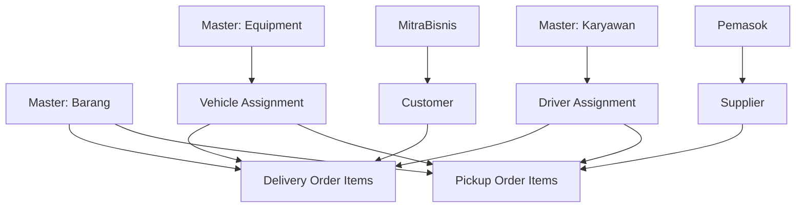

# MIGRASI WEB - 03 SUPPLY CHAIN MANAGEMENT (SCM)

## 📋 Module Overview

Supply Chain Management module handles logistics operations including delivery orders, pickup orders, and shipping management.

**Total Features:** 3 (2 active, 1 menu-only)  
**Priority:** 🟡 MEDIUM (Supporting operations)

---

## 🗂️ Features List

### 1. Delivery Order
**Route:** `/delivery-order`  
**API:** `src/api/delivery-order.js`  
**Views:** `src/views/scm/delivery-order/`

#### Pages
- **List:** `/delivery-order` - Display all delivery orders
- **Create:** `/delivery-order/create` - Create new delivery order
- **Show:** `/delivery-order/[id]/show` - View delivery order details
- **Delete:** `/delivery-order/[id]/destroy` - Delete confirmation page

#### API Endpoints
```javascript
{
  key: '/api/scm/delivery-order',
  list: '/list',
  create: '/create',
  show: '/:id',
  update: '/:id/update',
  delete: '/:id/destroy',
  // Additional endpoints
  byStatus: '/status/:status',
  byDate: '/tanggal/:tanggal',
  byCustomer: '/customer/:customer_id',
  print: '/:id/print',
  export: '/export'
}
```

#### Features
- ✅ CRUD operations
- ✅ Order number auto-generation
- ✅ Customer/recipient management
- ✅ Item list with quantities
- ✅ Delivery address
- ✅ Delivery date scheduling
- ✅ Driver assignment
- ✅ Vehicle assignment
- ✅ Delivery status tracking
- ✅ Proof of delivery (POD)
- ✅ Digital signature
- ✅ Photo evidence
- ✅ GPS tracking
- ✅ Print delivery note
- ✅ Export to PDF
- ✅ Offline support

#### Data Structure
```typescript
interface DeliveryOrder {
  id: number
  no_do: string // Auto-generated: DO-YYYYMMDD-XXX
  tanggal_order: string // Date
  tanggal_kirim: string // Scheduled delivery date
  
  // Customer
  customer_id?: number
  customer?: MitraBisnis
  customer_name: string // Manual if no customer_id
  customer_phone?: string
  customer_address: string
  
  // Delivery Location
  alamat_kirim: string
  kota_kirim: string
  kode_pos_kirim?: string
  latitude?: string
  longitude?: string
  
  // Assignment
  driver_id?: number
  driver?: Karyawan
  vehicle_id?: number
  vehicle?: Equipment
  
  // Items
  items: DeliveryOrderItem[]
  
  // Delivery Info
  catatan?: string
  instruksi_khusus?: string
  
  // Proof of Delivery
  delivered_at?: string
  delivered_by?: number
  recipient_name?: string
  recipient_signature?: string
  foto_bukti?: string[]
  gps_delivered?: {
    latitude: string
    longitude: string
  }
  
  // Status
  status: 'draft' | 'confirmed' | 'in_transit' | 'delivered' | 'cancelled'
  
  created_at: string
  updated_at: string
  created_by: number
}

interface DeliveryOrderItem {
  id: number
  delivery_order_id: number
  barang_id: number
  barang?: Barang
  qty: number
  satuan: string
  keterangan?: string
}
```

#### Form Fields (Create/Edit)
**Delivery Order Header:**
- Tanggal Order (date, required, default: today)
- Tanggal Kirim (date, required)
- Customer (autocomplete from MitraBisnis, optional)
- Nama Penerima (text, required if no customer)
- No. Telepon (text, optional)
- Alamat Penerima (textarea, required)
- Kota (text, required)
- Kode Pos (text, optional)
- Catatan (textarea, optional)
- Instruksi Khusus (textarea, optional)

**Delivery Order Items:**
- Barang (autocomplete from Barang, required)
- Qty (number, required, > 0)
- Satuan (text, auto-fill from barang, editable)
- Keterangan (text, optional)
- [Add Item Button]
- [Remove Item Button]

**Assignment (Optional):**
- Driver (autocomplete from Karyawan, optional)
- Kendaraan (autocomplete from Equipment, optional)

#### Show Page Components
1. **Order Information**
   - No DO
   - Tanggal Order
   - Tanggal Kirim
   - Status badge

2. **Customer Information**
   - Nama Penerima
   - No. Telepon
   - Alamat Lengkap
   - Map (if GPS available)

3. **Items Table**
   - Nama Barang
   - Qty
   - Satuan
   - Keterangan
   - Total items count

4. **Assignment**
   - Driver name
   - Vehicle info
   - Contact driver button

5. **Delivery Proof** (if delivered)
   - Delivered at timestamp
   - Recipient name
   - Signature image
   - Photos
   - GPS location map

6. **Actions**
   - Edit (if not delivered)
   - Print DO
   - Export PDF
   - Delete (if draft)
   - Mark as Delivered (if confirmed)
   - Cancel (if not delivered)

#### Business Logic
1. **DO Number Generation:**
   ```javascript
   format: DO-YYYYMMDD-XXX
   example: DO-20251223-001
   // XXX = sequential number per day
   ```

2. **Status Flow:**
   ```
   draft → confirmed → in_transit → delivered
                    ↓
                 cancelled
   ```

3. **Validation Rules:**
   - Tanggal kirim >= tanggal order
   - At least 1 item required
   - Item qty > 0
   - Cannot edit after delivered
   - Cannot delete if not draft
   - Unique DO number

#### Print Template
- Company header
- DO number and date
- Customer/recipient info
- Items table with quantities
- Driver & vehicle info
- Signature section (recipient)
- Notes/instructions
- Barcode (DO number)

---

### 2. Pickup Order
**Route:** `/pickup-order`  
**API:** `src/api/pickup-order.js`  
**Views:** `src/views/scm/pickup-order/`

#### Pages
- **List:** `/pickup-order` - Display all pickup orders

#### API Endpoints
```javascript
{
  key: '/api/scm/pickup-order',
  list: '/list',
  create: '/create',
  show: '/:id',
  update: '/:id/update',
  delete: '/:id/destroy',
  byStatus: '/status/:status',
  byDate: '/tanggal/:tanggal',
  bySupplier: '/supplier/:supplier_id'
}
```

#### Features
- ✅ CRUD operations
- ✅ Order number auto-generation
- ✅ Supplier management
- ✅ Item list
- ✅ Pickup address
- ✅ Pickup date scheduling
- ✅ Driver assignment
- ✅ Vehicle assignment
- ✅ Pickup status tracking
- ✅ Proof of pickup
- ✅ Digital signature
- ✅ Photo evidence
- ✅ Print pickup note
- ✅ Offline support

#### Data Structure
```typescript
interface PickupOrder {
  id: number
  no_po: string // Auto-generated: PO-YYYYMMDD-XXX
  tanggal_order: string
  tanggal_pickup: string
  
  // Supplier
  supplier_id?: number
  supplier?: Pemasok
  supplier_name: string
  supplier_phone?: string
  supplier_address: string
  
  // Pickup Location
  alamat_pickup: string
  kota_pickup: string
  kode_pos_pickup?: string
  latitude?: string
  longitude?: string
  
  // Assignment
  driver_id?: number
  driver?: Karyawan
  vehicle_id?: number
  vehicle?: Equipment
  
  // Items
  items: PickupOrderItem[]
  
  // Pickup Info
  catatan?: string
  
  // Proof of Pickup
  picked_at?: string
  picked_by?: number
  giver_name?: string
  giver_signature?: string
  foto_bukti?: string[]
  
  status: 'draft' | 'confirmed' | 'in_transit' | 'completed' | 'cancelled'
  
  created_at: string
  updated_at: string
  created_by: number
}

interface PickupOrderItem {
  id: number
  pickup_order_id: number
  barang_id: number
  barang?: Barang
  qty: number
  satuan: string
  keterangan?: string
}
```

#### Form Fields
Similar to Delivery Order but for pickup scenario:
- Tanggal Pickup
- Supplier/Pickup Location
- Items list
- Driver/Vehicle assignment
- Notes

---

### 3. Shipping Order
**Route:** N/A (Menu only)  
**Status:** ⚠️ Not implemented

#### Planned Features
- Shipping manifest
- Container tracking
- Port-to-port shipping
- Multi-leg shipping
- Cargo documentation
- Custom clearance tracking

**Note:** This is a menu placeholder for future implementation.

---

## 🔗 Module Dependencies

### Internal Dependencies


### External Dependencies
- AWS S3 (photo uploads)
- Google Maps API (GPS, address)
- PDF generation library (jsPDF)
- Barcode generator
- Digital signature pad

---

## 📋 Migration TODO - SCM

### Phase 1: Delivery Order
#### API Hooks
- [ ] Create delivery order API hooks
  - [ ] useGetDeliveryOrders (list)
  - [ ] useShowDeliveryOrder (detail)
  - [ ] useCreateDeliveryOrder (mutation)
  - [ ] useUpdateDeliveryOrder (mutation)
  - [ ] useDeleteDeliveryOrder (mutation)
  - [ ] useGetDOByStatus
  - [ ] useGetDOByDate
- [ ] Create customer/mitra bisnis API hooks
- [ ] Create pemasok API hooks

#### List Page
- [ ] Create desktop table view
- [ ] Create mobile card view
- [ ] Implement pagination
- [ ] Implement filters
  - [ ] Date range
  - [ ] Status
  - [ ] Customer
  - [ ] Driver
- [ ] Add status badges
- [ ] Add quick actions (view, edit, delete)
- [ ] Add bulk actions
- [ ] Add export button

#### Create/Edit Form
- [ ] Create form layout
- [ ] Add DO header fields
- [ ] Add customer autocomplete
- [ ] Add manual customer fields
- [ ] Add address fields
- [ ] Integrate Google Maps for address
- [ ] Create items table component
  - [ ] Add item row
  - [ ] Remove item row
  - [ ] Barang autocomplete
  - [ ] Qty validation
  - [ ] Satuan auto-fill
- [ ] Add driver autocomplete
- [ ] Add vehicle autocomplete
- [ ] Implement DO number auto-generation
- [ ] Implement form validation
- [ ] Add offline queue support
- [ ] Test form submission

#### Show Page
- [ ] Create show page layout
- [ ] Display order information
- [ ] Display customer information
- [ ] Display items table
- [ ] Display assignment info
- [ ] Display delivery proof (if delivered)
- [ ] Add Google Maps integration
- [ ] Add signature display
- [ ] Add photo gallery
- [ ] Add action buttons
  - [ ] Edit
  - [ ] Print
  - [ ] Export PDF
  - [ ] Delete
  - [ ] Mark as Delivered
  - [ ] Cancel
- [ ] Implement status change logic

#### Delete Confirmation
- [ ] Create delete confirmation page
- [ ] Display order summary
- [ ] Add confirmation button
- [ ] Handle soft delete
- [ ] Redirect after delete

#### Print & Export
- [ ] Create print template
  - [ ] Company header
  - [ ] DO details
  - [ ] Items table
  - [ ] Signature section
  - [ ] Barcode
- [ ] Implement print functionality
- [ ] Implement PDF export
- [ ] Add print preview
- [ ] Test printing

#### Proof of Delivery
- [ ] Create POD form
- [ ] Add recipient name field
- [ ] Add signature pad
- [ ] Add photo upload (multiple)
- [ ] Capture GPS coordinates
- [ ] Implement POD submission
- [ ] Update DO status
- [ ] Test POD flow

### Phase 2: Pickup Order
#### API Hooks
- [ ] Create pickup order API hooks
  - [ ] useGetPickupOrders
  - [ ] useShowPickupOrder
  - [ ] useCreatePickupOrder
  - [ ] useUpdatePickupOrder
  - [ ] useDeletePickupOrder

#### List Page
- [ ] Create desktop table view
- [ ] Create mobile card view
- [ ] Implement pagination
- [ ] Implement filters
- [ ] Add status badges
- [ ] Add quick actions

#### Create/Edit Form
- [ ] Create form layout
- [ ] Add PO header fields
- [ ] Add supplier autocomplete
- [ ] Add pickup address fields
- [ ] Create items table
- [ ] Add driver/vehicle assignment
- [ ] Implement PO number auto-generation
- [ ] Implement validation
- [ ] Add offline support

#### Show Page
- [ ] Create show page layout
- [ ] Display order information
- [ ] Display supplier information
- [ ] Display items table
- [ ] Display pickup proof
- [ ] Add action buttons

#### Proof of Pickup
- [ ] Create proof of pickup form
- [ ] Add giver name field
- [ ] Add signature pad
- [ ] Add photo upload
- [ ] Capture GPS
- [ ] Implement submission

#### Print & Export
- [ ] Create print template
- [ ] Implement print functionality
- [ ] Implement PDF export

### Phase 3: Shipping Order (Future)
- [ ] Design shipping order structure
- [ ] Design container tracking
- [ ] Design multi-leg shipping
- [ ] Plan customs integration
- [ ] Create initial wireframes

### Phase 4: Testing
- [ ] Test Delivery Order CRUD
- [ ] Test DO number generation
- [ ] Test item management
- [ ] Test driver/vehicle assignment
- [ ] Test status flow
- [ ] Test print/export
- [ ] Test POD submission
- [ ] Test GPS coordinates
- [ ] Test photo uploads
- [ ] Test offline mode
- [ ] Test Pickup Order CRUD
- [ ] Test PO number generation
- [ ] Test proof of pickup
- [ ] Test mobile responsiveness
- [ ] Test performance

### Phase 5: Documentation
- [ ] Document DO workflow
- [ ] Document PO workflow
- [ ] Document status transitions
- [ ] Document print templates
- [ ] Create user manual
- [ ] Document API endpoints

---

## ✅ Validation Rules

### Delivery Order
- No DO: auto-generated, unique
- Tanggal kirim >= tanggal order
- Tanggal order <= today
- Items: min 1 item required
- Item qty > 0
- Customer name or customer_id required
- Alamat kirim required
- Cannot edit if status = 'delivered'
- Cannot delete if status != 'draft'

### Pickup Order
- No PO: auto-generated, unique
- Tanggal pickup >= tanggal order
- Items: min 1 item required
- Item qty > 0
- Supplier name or supplier_id required
- Alamat pickup required
- Cannot edit if status = 'completed'
- Cannot delete if status != 'draft'

### Status Transitions
**Delivery Order:**
- draft → confirmed (manual)
- confirmed → in_transit (when driver starts)
- in_transit → delivered (POD submitted)
- any → cancelled (manual, except delivered)

**Pickup Order:**
- draft → confirmed (manual)
- confirmed → in_transit (when driver starts)
- in_transit → completed (proof submitted)
- any → cancelled (manual, except completed)

---

## 🎯 Success Criteria

- [ ] Delivery Order CRUD fully functional
- [ ] Pickup Order CRUD fully functional
- [ ] DO/PO number auto-generation working
- [ ] Item management working
- [ ] Driver/vehicle assignment working
- [ ] Status transitions correct
- [ ] Print templates formatted correctly
- [ ] PDF export working
- [ ] POD submission working
- [ ] Signature capture working
- [ ] Photo upload working
- [ ] GPS coordinates saving
- [ ] Offline mode working
- [ ] Mobile responsive
- [ ] Performance acceptable

---

**Priority:** 🟡 MEDIUM  
**Estimated Effort:** 30-40 hours  
**Dependencies:** Master Data (Barang, Equipment, Karyawan), MitraBisnis, Pemasok  
**Risk Level:** Medium
