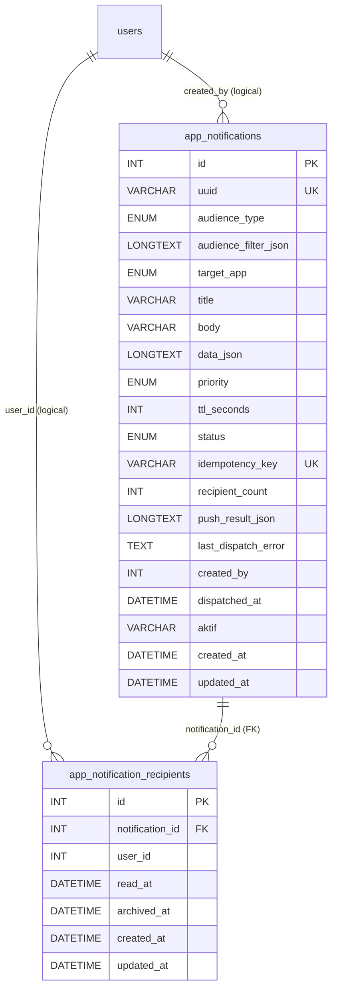

# Durable Notifications Database and DDL Specification

## 1. Tujuan Dokumen

Dokumen ini menjadi acuan teknis untuk pembuatan, review, deployment, verifikasi, dan rollback database durable notifications. Source of truth implementasi tetap migration backend:

- `be/database/migrations/20260803000100_create_app_notifications.js`
- `be/database/migrations/20260803000200_add_push_notifications_menu.js`
- `be/database/migrations/20260803000300_expand_app_notification_audiences.js`

SQL di dokumen ini adalah bentuk ekuivalen MySQL dari migration tersebut. Gunakan migration Adonis untuk deployment normal agar histori schema tetap tercatat.

Migration create awal sudah berisi schema audience lengkap untuk instalasi baru. Migration `20260803000300` tetap diperlukan sebagai compatibility migration pada environment yang pernah menjalankan versi create lama.

Fitur tidak membuat database/schema MySQL baru. Kedua tabel dibuat di database backend MKG yang sudah dikonfigurasi melalui environment Adonis.

## 2. Ruang Lingkup Data

Fitur memakai dua tabel baru:

| Tabel                         | Fungsi                                             | Pertumbuhan                                  |
| ----------------------------- | -------------------------------------------------- | -------------------------------------------- |
| `app_notifications`           | Satu row untuk setiap pesan yang dibuat            | Linear terhadap jumlah pesan                 |
| `app_notification_recipients` | Satu row untuk setiap pasangan pesan dan recipient | Linear terhadap jumlah pesan dikali audience |

Fitur juga menambah satu row submenu `/push-notifications` pada `sys_submenupermission`. Permission user tetap disimpan menggunakan mekanisme existing `sys_accesspermission`.

## 3. Relasi Data



`created_by` dan `user_id` adalah relasi logical ke `users.id`, bukan foreign key database pada implementasi fase pertama. Hal ini menghindari migration gagal pada environment lama yang belum mempunyai constraint atau tipe kolom user yang seragam. Validitas user dijaga oleh service saat notification dibuat.

## 4. Tabel `app_notifications`

### 4.1 Data Dictionary

| Kolom                  | Tipe                                                          | Null  | Default        | Constraint/Indeks | Keterangan                                           |
| ---------------------- | ------------------------------------------------------------- | ----- | -------------- | ----------------- | ---------------------------------------------------- |
| `id`                   | `INT UNSIGNED`                                                | Tidak | Auto increment | Primary key       | Identifier internal untuk join                       |
| `uuid`                 | `VARCHAR(36)`                                                 | Tidak | Tidak ada      | Unique            | Identifier publik pada URL dan payload push          |
| `audience_type`        | `ENUM('broadcast','business','branch','section','personal')`  | Tidak | Tidak ada      | -                 | Cara recipient dipilih                               |
| `audience_filter_json` | `LONGTEXT`                                                    | Ya    | `NULL`         | -                 | Snapshot filter business, cabang, section, atau user |
| `target_app`           | `ENUM('app_emp','app_oprdrv','web','all')`                    | Tidak | Tidak ada      | -                 | Channel dan scope inbox                              |
| `title`                | `VARCHAR(100)`                                                | Tidak | Tidak ada      | -                 | Judul yang ditampilkan ke recipient                  |
| `body`                 | `VARCHAR(500)`                                                | Tidak | Tidak ada      | -                 | Isi utama notification                               |
| `data_json`            | `LONGTEXT`                                                    | Ya    | `NULL`         | -                 | Custom payload JSON serialized                       |
| `priority`             | `ENUM('default','high')`                                      | Tidak | `default`      | -                 | Priority push gateway                                |
| `ttl_seconds`          | `INT UNSIGNED`                                                | Ya    | `NULL`         | -                 | TTL push dalam detik; `NULL` memakai default gateway |
| `status`               | `ENUM('pending','processing','completed','partial','failed')` | Tidak | `pending`      | Composite index   | Status dispatch agregat                              |
| `idempotency_key`      | `VARCHAR(191)`                                                | Tidak | Tidak ada      | Unique            | Mencegah create/dispatch ganda                       |
| `recipient_count`      | `INT UNSIGNED`                                                | Tidak | `0`            | -                 | Snapshot jumlah recipient saat create                |
| `push_result_json`     | `LONGTEXT`                                                    | Ya    | `NULL`         | -                 | Hasil per channel dari push gateway                  |
| `last_dispatch_error`  | `TEXT`                                                        | Ya    | `NULL`         | -                 | Ringkasan error terakhir untuk operator              |
| `created_by`           | `INT UNSIGNED`                                                | Tidak | Tidak ada      | Index             | `users.id` pembuat notification                      |
| `dispatched_at`        | `DATETIME`                                                    | Ya    | `NULL`         | -                 | Waktu percobaan dispatch terakhir selesai            |
| `aktif`                | `VARCHAR(1)`                                                  | Tidak | `Y`            | -                 | Soft-active flag mengikuti pola project              |
| `created_at`           | Timestamp migration                                           | Ya    | Framework      | Composite index   | Waktu row dibuat                                     |
| `updated_at`           | Timestamp migration                                           | Ya    | Framework      | -                 | Waktu row terakhir diperbarui                        |

### 4.2 Constraint dan Indeks

| Nama/logical key                       | Kolom                  | Tujuan                                        |
| -------------------------------------- | ---------------------- | --------------------------------------------- |
| Primary key                            | `id`                   | Join dan lookup internal                      |
| Unique UUID                            | `uuid`                 | Satu identifier publik per notification       |
| Unique idempotency                     | `idempotency_key`      | Exactly-once create pada retry request client |
| `idx_app_notifications_status_created` | `status`, `created_at` | History/filter berdasarkan status terbaru     |
| `idx_app_notifications_created_by`     | `created_by`           | Audit berdasarkan pembuat                     |

## 5. Tabel `app_notification_recipients`

### 5.1 Data Dictionary

| Kolom             | Tipe                | Null  | Default        | Constraint/Indeks        | Keterangan                           |
| ----------------- | ------------------- | ----- | -------------- | ------------------------ | ------------------------------------ |
| `id`              | `INT UNSIGNED`      | Tidak | Auto increment | Primary key              | Identifier row recipient             |
| `notification_id` | `INT UNSIGNED`      | Tidak | Tidak ada      | FK, unique pair          | Referensi ke `app_notifications.id`  |
| `user_id`         | `INT UNSIGNED`      | Tidak | Tidak ada      | Unique pair, inbox index | Recipient berdasarkan `users.id`     |
| `read_at`         | `DATETIME`          | Ya    | `NULL`         | Inbox index              | `NULL` berarti belum dibaca          |
| `archived_at`     | `DATETIME`          | Ya    | `NULL`         | Inbox index              | `NULL` berarti masih tampil di inbox |
| `created_at`      | Timestamp migration | Ya    | Framework      | -                        | Waktu audience materialized          |
| `updated_at`      | Timestamp migration | Ya    | Framework      | -                        | Waktu status recipient berubah       |

### 5.2 Constraint dan Indeks

| Nama                                         | Kolom                               | Tujuan                                         |
| -------------------------------------------- | ----------------------------------- | ---------------------------------------------- |
| `uq_app_notification_recipient`              | `notification_id`, `user_id`        | Mencegah recipient ganda untuk pesan yang sama |
| `idx_app_notification_inbox`                 | `user_id`, `read_at`, `archived_at` | List/unread count berdasarkan user             |
| `fk_app_notification_recipient_notification` | `notification_id`                   | Menjamin notification ada; `ON DELETE CASCADE` |

Tidak ada FK `user_id -> users.id`. Penghapusan user tidak otomatis menghapus histori recipient. Keputusan retention untuk orphan recipient harus dilakukan sebagai proses maintenance terpisah jika diperlukan.

## 6. DDL MySQL Ekuivalen

DDL berikut dapat dipakai untuk review atau recovery manual. Nama database, engine, charset, collation, dan presisi timestamp mengikuti default environment karena migration tidak mengubahnya secara eksplisit.

```sql
CREATE TABLE IF NOT EXISTS `app_notifications` (
  `id` INT UNSIGNED NOT NULL AUTO_INCREMENT,
  `uuid` VARCHAR(36) NOT NULL,
  `audience_type` ENUM('broadcast', 'business', 'branch', 'section', 'personal') NOT NULL,
  `audience_filter_json` LONGTEXT NULL,
  `target_app` ENUM('app_emp', 'app_oprdrv', 'web', 'all') NOT NULL,
  `title` VARCHAR(100) NOT NULL,
  `body` VARCHAR(500) NOT NULL,
  `data_json` LONGTEXT NULL,
  `priority` ENUM('default', 'high') NOT NULL DEFAULT 'default',
  `ttl_seconds` INT UNSIGNED NULL,
  `status` ENUM('pending', 'processing', 'completed', 'partial', 'failed')
    NOT NULL DEFAULT 'pending',
  `idempotency_key` VARCHAR(191) NOT NULL,
  `recipient_count` INT UNSIGNED NOT NULL DEFAULT 0,
  `push_result_json` LONGTEXT NULL,
  `last_dispatch_error` TEXT NULL,
  `created_by` INT UNSIGNED NOT NULL,
  `dispatched_at` DATETIME NULL,
  `aktif` VARCHAR(1) NOT NULL DEFAULT 'Y',
  `created_at` DATETIME NULL,
  `updated_at` DATETIME NULL,
  PRIMARY KEY (`id`),
  UNIQUE KEY `uq_app_notifications_uuid` (`uuid`),
  UNIQUE KEY `uq_app_notifications_idempotency_key` (`idempotency_key`),
  KEY `idx_app_notifications_status_created` (`status`, `created_at`),
  KEY `idx_app_notifications_created_by` (`created_by`)
);

CREATE TABLE IF NOT EXISTS `app_notification_recipients` (
  `id` INT UNSIGNED NOT NULL AUTO_INCREMENT,
  `notification_id` INT UNSIGNED NOT NULL,
  `user_id` INT UNSIGNED NOT NULL,
  `read_at` DATETIME NULL,
  `archived_at` DATETIME NULL,
  `created_at` DATETIME NULL,
  `updated_at` DATETIME NULL,
  PRIMARY KEY (`id`),
  UNIQUE KEY `uq_app_notification_recipient` (`notification_id`, `user_id`),
  KEY `idx_app_notification_inbox` (`user_id`, `read_at`, `archived_at`),
  CONSTRAINT `fk_app_notification_recipient_notification`
    FOREIGN KEY (`notification_id`)
    REFERENCES `app_notifications` (`id`)
    ON DELETE CASCADE
);
```

Nama unique key untuk `uuid` dan `idempotency_key` dapat berbeda ketika dibuat oleh Knex karena migration tidak memberi nama eksplisit. Constraint semantics tetap sama.

## 7. DML Menu dan Permission

Migration menu melakukan operasi idempotent berikut:

1. Memastikan tabel `sys_menupermission` dan `sys_submenupermission` tersedia.
2. Mencari menu `setting` atau title `Setting`.
3. Membuat menu Setting jika belum ada.
4. Mencari submenu berdasarkan URL `/push-notifications`.
5. Membuat submenu dengan urutan terakhir + 1 jika belum ada.

SQL konseptual untuk row submenu:

```sql
INSERT INTO `sys_submenupermission` (
  `menu_id`, `name`, `title`, `type`, `url`, `icon`,
  `breadcrumbs`, `urut`, `aktif`
) VALUES (
  :setting_menu_id, 'push-notifications', 'Push Notifications',
  'item', '/push-notifications', 'notification', 'N', :next_order, 'Y'
);
```

Migration tidak memberikan access otomatis. Administrator harus membuat row `sys_accesspermission` untuk user composer dengan action berikut:

| Action   | Kebutuhan                                             |
| -------- | ----------------------------------------------------- |
| `read`   | Membuka composer, history, detail, dan pencarian user |
| `insert` | Membuat notification                                  |
| `update` | Retry notification `failed`/`partial`                 |

Role `developer` mendapat override ketiga action dari service backend.

## 8. Lifecycle Penulisan Data

### 8.1 Create Notification

Seluruh langkah berikut dilakukan dalam satu transaction database:

1. Cek `idempotency_key` existing.
2. Untuk broadcast, resolve seluruh user aktif. Audience lain memvalidasi ulang `user_ids` final dari field multiple Recipients; filter organisasi tetap disimpan pada `audience_filter_json` untuk audit.
3. Insert satu row `app_notifications` dengan status `pending`.
4. Insert recipient dalam batch maksimum 500 row.
5. Commit transaction.

Push baru dilakukan setelah commit. Dengan urutan ini, error gateway tidak menghapus inbox yang sudah durable.

### 8.2 Dispatch

1. Update status menjadi `processing`.
2. Kirim request untuk setiap mobile channel target.
3. Serialize hasil per channel ke `push_result_json`.
4. Set status `completed`, `partial`, atau `failed`.
5. Simpan `last_dispatch_error` dan `dispatched_at`.

### 8.3 Read State

- Mark read mengisi `read_at` hanya jika masih `NULL`.
- Mark all read mengisi `read_at` untuk seluruh unread recipient pada app scope.
- Operasi read tidak mengubah notification utama.
- Target `all` memakai satu recipient row, sehingga read-state dibagi oleh web dan kedua mobile app.

## 9. Query Utama

### 9.1 Inbox

```sql
SELECT n.*, r.read_at, r.archived_at
FROM app_notification_recipients r
INNER JOIN app_notifications n ON n.id = r.notification_id
WHERE r.user_id = :authenticated_user_id
  AND r.archived_at IS NULL
  AND n.aktif = 'Y'
  AND n.target_app IN (:requested_app, 'all')
ORDER BY n.created_at DESC
LIMIT :limit OFFSET :offset;
```

Tambahkan `r.read_at IS NULL` untuk unread atau `r.read_at IS NOT NULL` untuk read.

### 9.2 Unread Count

```sql
SELECT COUNT(*) AS total
FROM app_notification_recipients r
INNER JOIN app_notifications n ON n.id = r.notification_id
WHERE r.user_id = :authenticated_user_id
  AND r.read_at IS NULL
  AND r.archived_at IS NULL
  AND n.aktif = 'Y'
  AND n.target_app IN (:requested_app, 'all');
```

### 9.3 Detail dengan Ownership

```sql
SELECT n.*, r.read_at, r.archived_at
FROM app_notification_recipients r
INNER JOIN app_notifications n ON n.id = r.notification_id
WHERE r.user_id = :authenticated_user_id
  AND n.uuid = :notification_uuid
  AND r.archived_at IS NULL
  AND n.aktif = 'Y'
  AND n.target_app IN (:requested_app, 'all')
LIMIT 1;
```

`user_id` selalu berasal dari JWT, bukan request body atau query.

## 10. Kapasitas dan Retention

Jumlah row recipient dapat dihitung dengan:

```text
recipient_rows_per_period = jumlah_notification x rata_rata_recipient
```

Contoh: 20 broadcast per hari kepada 2.000 user menghasilkan sekitar 40.000 recipient row per hari atau 1,2 juta row per 30 hari.

Fase pertama belum menghapus histori otomatis. Sebelum menetapkan retention:

- ukur pertumbuhan row dan ukuran index;
- sepakati kebutuhan audit bisnis;
- tentukan apakah notification dan recipient boleh dihapus permanen;
- lakukan purge dalam batch, bukan satu delete besar;
- pertahankan urutan delete parent/child atau gunakan cascade dengan hati-hati.

## 11. Backup, Deployment, dan Locking

- Ambil backup sebelum migration production.
- Pastikan default storage engine mendukung foreign key, misalnya InnoDB, dan kedua tabel memakai engine yang sama.
- Jalankan migration pada periode traffic rendah jika schema metadata lambat.
- Pembuatan dua tabel baru tidak memerlukan backfill.
- Insert broadcast dilakukan dalam batch 500 recipient untuk membatasi ukuran statement.
- Jangan menjalankan SQL manual dan migration bersamaan.
- Setelah migration, simpan output `SHOW CREATE TABLE` sebagai bukti schema aktual environment.

Perintah deployment normal dari folder `be`:

```bash
node ace migration:status
node ace migration:run
node ace migration:status
```

Pada environment production, Adonis memerlukan `node ace migration:run --force`. Jalankan perintah menggunakan environment dan credential database target yang sudah diverifikasi. Jangan menaruh credential database pada dokumen atau command history.

## 12. Verifikasi Pasca-Migration

```sql
SHOW CREATE TABLE `app_notifications`;
SHOW CREATE TABLE `app_notification_recipients`;

SHOW INDEX FROM `app_notifications`;
SHOW INDEX FROM `app_notification_recipients`;

SELECT `id`, `menu_id`, `name`, `title`, `url`, `aktif`
FROM `sys_submenupermission`
WHERE `url` = '/push-notifications';

SELECT COUNT(*) AS orphan_notifications
FROM `app_notification_recipients` r
LEFT JOIN `app_notifications` n ON n.id = r.notification_id
WHERE n.id IS NULL;

SELECT `notification_id`, `user_id`, COUNT(*) AS total
FROM `app_notification_recipients`
GROUP BY `notification_id`, `user_id`
HAVING COUNT(*) > 1;
```

Expected result:

- kedua tabel tersedia;
- UUID dan idempotency key mempunyai unique index;
- unique recipient pair dan FK notification tersedia;
- submenu tepat satu row dan aktif;
- orphan notification serta duplicate recipient berjumlah nol.

## 13. Rollback

Migration `down` menghapus child table lebih dulu:

```sql
DROP TABLE IF EXISTS `app_notification_recipients`;
DROP TABLE IF EXISTS `app_notifications`;
```

Rollback menu hanya menghapus submenu jika belum memiliki row pada `sys_accesspermission`. Ini mencegah permission existing menjadi orphan tanpa persetujuan operator.

Rollback migration ekspansi mengubah audience `business`, `branch`, dan `section` menjadi `personal` sebelum mempersempit enum, lalu menghapus `audience_filter_json`. Recipient snapshot tetap tersedia, tetapi informasi filter organisasi hilang.

Jangan menjalankan rollback tabel setelah production menerima pesan tanpa:

1. menonaktifkan composer;
2. menghentikan backend yang menulis notification;
3. membuat backup;
4. memperoleh persetujuan kehilangan histori;
5. memverifikasi tidak ada proses dispatch aktif.

## 14. Keputusan dan Batasan Schema

| Keputusan                             | Alasan                                       | Konsekuensi                                        |
| ------------------------------------- | -------------------------------------------- | -------------------------------------------------- |
| Materialized recipient per user       | Query inbox dan ownership sederhana          | Broadcast menghasilkan banyak row                  |
| Filter audience disimpan sebagai JSON | Audit kriteria tanpa kolom nullable per tipe | Validitas JSON dijaga aplikasi                     |
| JSON disimpan sebagai `LONGTEXT`      | Kompatibel dengan database existing          | Validitas JSON dijaga aplikasi, bukan DB           |
| Unique idempotency key global         | Mencegah create ganda                        | Key tidak dapat digunakan ulang untuk payload lain |
| Read-state pada recipient             | Mendukung status per user                    | Target `all` berbagi status antar app              |
| FK hanya ke notification              | Deployment lebih kompatibel                  | Integritas user bersifat logical                   |
| Soft-active pada notification         | Mengikuti pola project                       | Semua query wajib memfilter `aktif='Y'`            |

## 15. Rekomendasi Fase Berikutnya

Rekomendasi berikut belum diterapkan dan memerlukan migration baru setelah data produksi dianalisis:

- Tambahkan index yang dihasilkan dari `EXPLAIN` query produksi bila composite index existing belum optimal.
- Tambahkan tabel dispatch attempts jika setiap retry harus diaudit sebagai row terpisah.
- Tambahkan receipt status per device bila delivery final perlu dilacak.
- Tambahkan retention job dan archive storage setelah kebijakan audit disepakati.
- Pertimbangkan queue worker untuk audience besar agar request composer tidak menunggu dispatch.
