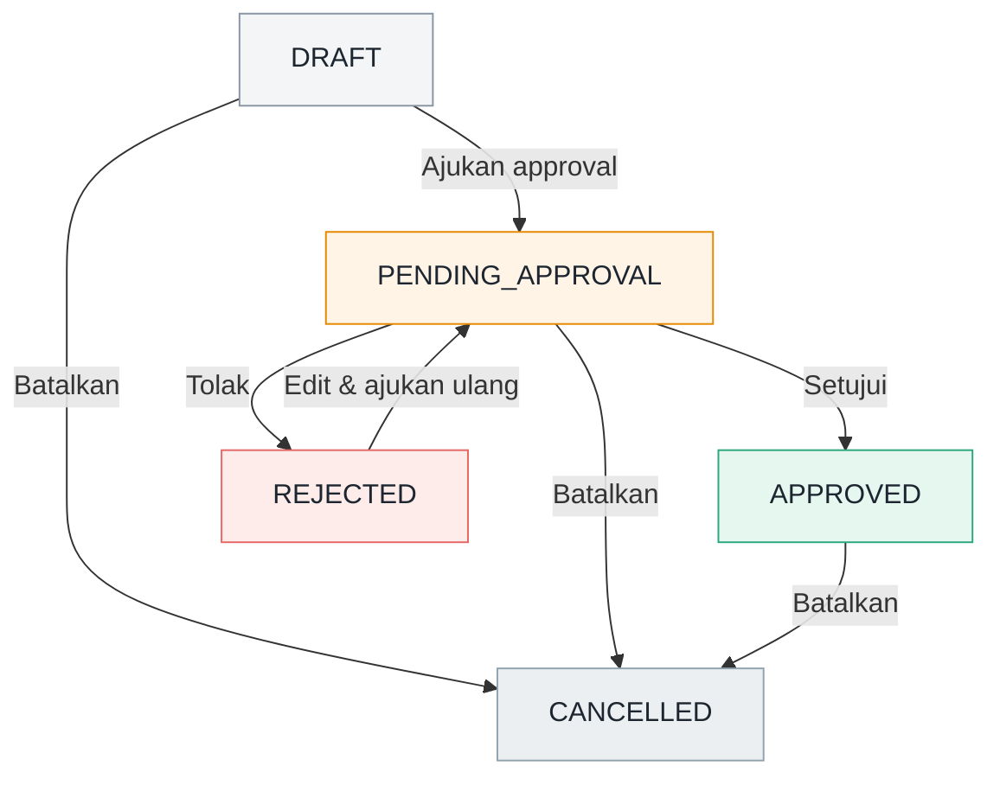

# Bantuan — Kontrak Tarif Rental

> Panduan ini menjelaskan cara menggunakan fitur **Kontrak Tarif Rental** untuk
> mengelola kesepakatan sewa equipment beserta aturan tarifnya.

---

## Daftar Isi

1. [Ringkasan Fitur](#ringkasan-fitur)
2. [Istilah Penting](#istilah-penting)
3. [Alur Status Kontrak](#alur-status-kontrak)
4. [Cara Membuat Kontrak](#cara-membuat-kontrak)
5. [Cara Edit & Kelola Kontrak](#cara-edit--kelola-kontrak)
6. [Dashboard & Filter](#dashboard--filter)
7. [FAQ / Troubleshooting](#faq--troubleshooting)

---

## Ringkasan Fitur

Kontrak Tarif Rental adalah fitur untuk mencatat **kesepakatan komersial sewa
equipment** antara perusahaan dan penyewa. Satu kontrak berisi:

- **Identitas kontrak** — nomor kontrak, unit bisnis, penyewa, dan periode sewa.
- **Satu atau lebih grup tarif** — setiap grup berlaku untuk sekumpulan
  equipment dengan konfigurasi harga yang sama (skema tarif, harga satuan,
  minimum kuantitas, minimum periode).
- **Role equipment** — `MAIN` (utama) atau `BACKUP` (cadangan).

Tujuan fitur ini adalah memastikan tarif sewa per equipment tercatat rapi,
tervalidasi (tidak ada periode yang tumpang-tindih), dan melalui proses
persetujuan sebelum dianggap aktif.

---

## Istilah Penting

| Istilah | Penjelasan |
|---|---|
| **Kontrak** | Dokumen kesepakatan sewa untuk satu penyewa pada satu unit bisnis. |
| **Penyewa** | Pelanggan yang menyewa equipment. |
| **Equipment** | Unit alat berat yang disewakan. |
| **Grup tarif** | Kelompok equipment dengan aturan harga yang sama. |
| **Role** | `MAIN` = equipment utama, `BACKUP` = equipment cadangan. |
| **Skema tarif (billing unit)** | Dasar penghitungan tarif: `Per jam` / `Per hari` / `Per bulan`. |
| **Minimum periode** | Satuan minimum masa sewa: per hari, per bulan kalender, atau seluruh masa sewa. |
| **Status** | Tahapan siklus hidup kontrak (lihat alur status). |

---

## Alur Status Kontrak

Sebuah kontrak melewati tahapan berikut:

| Status | Label di Aplikasi | Arti |
|---|---|---|
| `DRAFT` | Draft | Kontrak baru / sedang disusun, belum berlaku. |
| `PENDING_APPROVAL` | Menunggu Approval | Sudah diajukan, menunggu persetujuan. |
| `APPROVED` | Disetujui | Disetujui dan aktif (terkunci, tidak bisa diubah). |
| `REJECTED` | Ditolak | Ditolak, dapat diedit lalu diajukan ulang. |
| `CANCELLED` | Dibatalkan | Dibatalkan, tidak berlaku. |

> **Catatan penting:** Kontrak berstatus `APPROVED` bersifat **read-only**.
> Untuk perubahan, buat amendemen/kontrak revisi baru.

---

## Cara Membuat Kontrak

1. Buka halaman **Kontrak Rental** (`/rental-contracts`).
2. Klik tombol **"Buat Kontrak"** di kanan atas.
3. Isi bagian **01 · Identitas**:
   - **Nomor kontrak** — mis. `KTR-RNT-2026-001` (wajib, unik).
   - **Unit bisnis** — pilih unit bisnis (wajib).
   - **Penyewa** — pilih penyewa (wajib).
   - **Mulai kontrak** & **Akhir kontrak** — rentang masa sewa (wajib).
   - **Catatan kontrak** — opsional, konteks site/pekerjaan/legal.
4. Isi bagian **02 · Equipment & Tarif** (minimal satu grup tarif):
   - Pilih satu atau lebih **equipment**.
   - Tentukan **role** grup: `Utama` atau `Cadangan`.
   - **Mulai berlaku** & **Berakhir** — periode tarif (harus di dalam masa kontrak).
   - **Skema tarif** — per jam / per hari / per bulan.
   - **Harga satuan** — harga sewa (harus > 0).
   - **Minimum kuantitas** — jumlah minimum penagihan.
   - **Minimum berlaku** — per hari / per bulan kalender / seluruh masa sewa.
5. Klik **"Tambah grup"** bila ingin memisahkan equipment dengan tarif berbeda.
6. Klik **"Simpan draft"**.

> Validasi otomatis akan menolak jika: tanggal tidak valid, periode tarif
> berada di luar masa kontrak, atau equipment yang sama memiliki periode tarif
> yang tumpang-tindih antar grup.

---

## Cara Edit & Kelola Kontrak

Setelah kontrak tersimpan, buka halaman detail kontrak untuk melakukan aksi.

### Edit kontrak

- Tersedia hanya saat status `DRAFT` atau `REJECTED`.
- Klik **"Edit"** lalu ubah data, kemudian **"Simpan draft"**.

### Aksi status (sesuai hak akses)

| Aksi | Muncul saat status | Hasil |
|---|---|---|
| **Ajukan approval** | `DRAFT` | Status menjadi `PENDING_APPROVAL`. |
| **Setujui** | `PENDING_APPROVAL` | Status menjadi `APPROVED` (terkunci). |
| **Tolak** | `PENDING_APPROVAL` | Status menjadi `REJECTED` (wajib isi alasan). |
| **Batalkan** | `DRAFT`, `PENDING_APPROVAL`, `APPROVED` | Status menjadi `CANCELLED` (wajib isi alasan). |

> Setiap perubahan status dicatat pada bagian **Riwayat Aktivitas**.

---

## Dashboard & Filter

Halaman daftar kontrak menampilkan **kartu ringkasan**:

| Kartu | Keterangan |
|---|---|
| **Kontrak Aktif** | Jumlah kontrak berstatus `APPROVED`. |
| **Equipment Main** | Total equipment dengan role `MAIN` pada kontrak aktif. |
| **Equipment Backup** | Total equipment dengan role `BACKUP` pada kontrak aktif. |
| **Expired Terdekat** | Tanggal berakhir paling dekat dari kontrak aktif. |

### Menggunakan filter

Klik ikon **Filter** untuk membuka panel filter. Filter yang tersedia:

- **Kode kontrak** — cari berdasarkan nomor kontrak.
- **Penyewa** — filter berdasarkan penyewa.
- **Status** — filter berdasarkan status kontrak.
- **Narasi / Catatan** — cari berdasarkan isi catatan.
- **Role Equipment** — `Main` / `Backup`.
- **Skema Tarif** — per jam / per hari / per bulan.
- **Equipment (multi)** — filter berdasarkan satu/beberapa equipment.

Klik **"Terapkan"** untuk menjalankan filter, atau **"Reset"** untuk
mengembalikan ke kondisi awal.

---

## FAQ / Troubleshooting

**Q: Kenapa tanggal tidak muncul saat mengedit kontrak?**
A: Pastikan data tanggal tersimpan dengan benar. Aplikasi otomatis
menormalkan tanggal dari server ke format `YYYY-MM-DD` agar sesuai dengan input
tanggal di formulir. Jika masih kosong, muat ulang halaman.

**Q: Kenapa tombol "Edit" tidak muncul?**
A: Kontrak berstatus `APPROVED` bersifat read-only. Hanya status `DRAFT` dan
`REJECTED` yang dapat diedit.

**Q: Kenapa tombol "Ajukan approval" / "Setujui" tidak ada?**
A: Tindakan tersebut dibatasi oleh **hak akses** (permission) user. Hubungi
administrator bila membutuhkan akses.

**Q: Muncul pesan "Equipment ... overlap dengan kontrak approved"?**
A: Equipment yang sama sedang digunakan pada kontrak aktif lain dengan periode
yang tumpang-tindih. Sesuaikan periode atau pilih equipment lain.

**Q: Muncul pesan "Periode tarif harus berada dalam masa kontrak"?**
A: Tanggal "Mulai berlaku" / "Berakhir" pada grup tarif harus berada di dalam
rentang tanggal kontrak.

**Q: Muncul pesan "Equipment yang sama tidak boleh memiliki periode tarif yang overlap"?**
A: Satu equipment tidak boleh tercantum di dua grup tarif dengan periode yang
saling tumpang-tindih.

**Q: Bagaimana cara membatalkan kontrak?**
A: Buka detail kontrak, klik **"Batalkan"**, isi alasan, lalu konfirmasi.
Kontrak akan berstatus `CANCELLED`.

**Q: Bisakah kontrak yang sudah dibatalkan diaktifkan kembali?**
A: Tidak. Kontrak `CANCELLED` bersifat final. Buat kontrak baru bila diperlukan.
